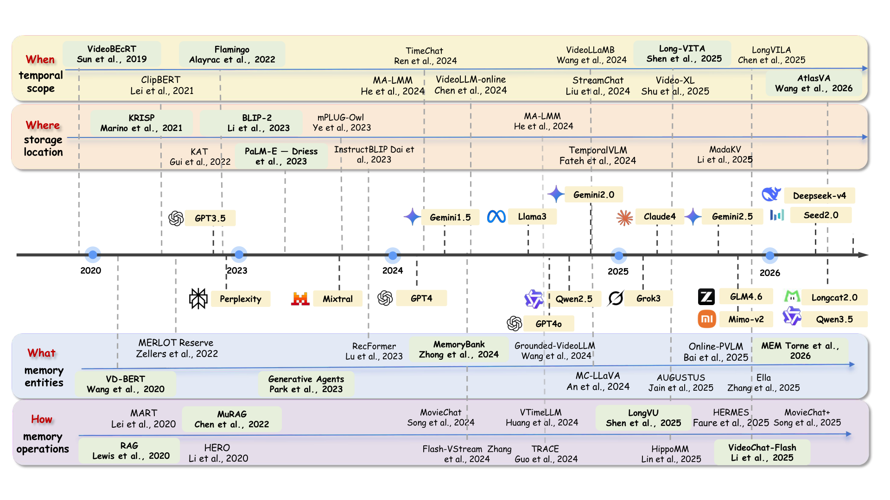
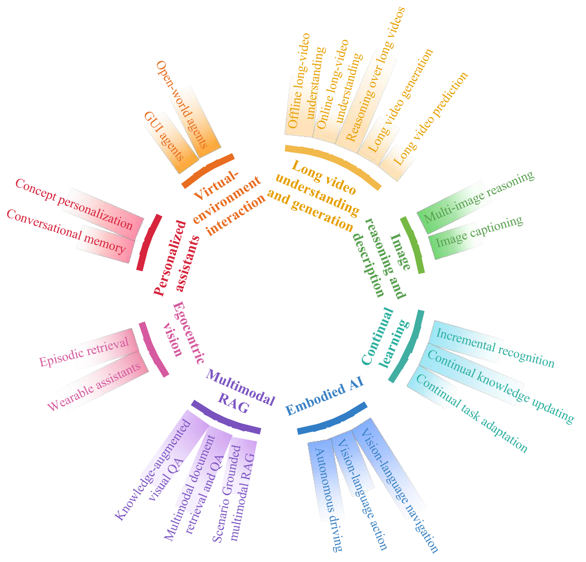

<h1 align="center">
  Awesome-Memory-in-VLM
  <a href="https://github.com/sindresorhus/awesome"></a>
</h1>

[](https://github.com/Xzcv-hub/Awesome-Memory-in-VLM/stargazers)
[](LICENSE)
[](#paper-list)
[](https://github.com/Xzcv-hub/Awesome-Memory-in-VLM/releases)
[](http://xhslink.com/o/5f7VnlQzGzS)
[](https://doi.org/10.20944/preprints202607.1539.v1)

> **Our paper is in preprint:** *Memory in Vision-Language Models: Taxonomy, Mechanisms, and Applications*
> 
> <small><em>The preprint has been online for about a week and has received nearly 300 downloads. We are currently working on version 2.0. If we've missed any relevant papers, we'd love to hear from you. We're also rolling out a dynamic update mechanism. Thank you all for sharing it and starring the project!</em></small>

---

## 🤝 Community Support

We actively maintain this repository and incorporate new research as it emerges. If you have suggestions about our taxonomy, find any relevant papers we have missed, or notice that a listed preprint has been accepted by a conference or journal, we warmly welcome your contributions.

Please [submit a pull request](https://github.com/Xzcv-hub/Awesome-Memory-in-VLM/pulls) using the following Markdown format:

```markdown
- [Paper Title](paper-link) (Conference/Journal/Preprint Year)
```

All contributions will be acknowledged in this repository. Thank you for helping us keep this survey comprehensive and up to date!

---

## 🧭 Survey at a Glance

Most vision-language models still process each prompt, clip, or interaction as an isolated episode. Without an explicit way to preserve and reuse prior multimodal information, they struggle with temporal coherence, accumulated knowledge, and reasoning that extends beyond a finite context window. This survey studies how memory turns VLMs from largely stateless predictors into systems that can retain, retrieve, revise, and reuse experience over time.

We organize this rapidly growing field through a system-oriented 4D taxonomy: **When** is information retained, **Where** is it stored, **What** does it represent, and **How** is it written, consolidated, retrieved, updated, or forgotten? This view connects architectural choices with evaluation protocols and real-world applications, while highlighting open challenges in scalability, efficiency, continual adaptation, multimodal grounding, and trustworthy memory management.

## 🕰️ From Context Windows to Persistent Memory

Memory in VLMs has evolved from bounded context and recurrent states toward compressed, retrievable, persistent, and agent-oriented systems. The timeline below places representative methods alongside the broader development of foundation models and traces progress through the four questions that define our taxonomy.

<p align="center">
  
</p>

<p align="center"><em>Representative milestones in memory-enabled VLMs across the When, Where, What, and How dimensions.</em></p>

## 🌐 Where Memory Makes a Difference

Memory is not limited to one model family or task. It supports long-range perception and generation, preserves knowledge during continual learning, grounds retrieval in multimodal evidence, and helps embodied or personalized agents maintain state across long-horizon and multi-session interactions. We group these uses into eight application domains and their key subareas.

<p align="center">
  
</p>

<p align="center"><em>Application landscape of memory-enhanced vision-language models.</em></p>


---

## 📚 Contents
- [Memory Mechanisms: 4D Taxonomy](#memory-mechanisms-4d-taxonomy)
  - [1. When: Temporal Scope](#1-when-temporal-scope)
  - [2. Where: Storage Location](#2-where-storage-location)
  - [3. What: Memory Entities](#3-what-memory-entities)
  - [4. How: Memory Operations](#4-how-memory-operations)
- [Application Papers](#application-papers)
  - [1. Long Video Understanding & Generation](#1-long-video-understanding--generation)
  - [2. Image Reasoning & Description](#2-image-reasoning--description)
  - [3. Continual Learning](#3-continual-learning)
  - [4. Embodied AI](#4-embodied-ai)
  - [5. Multimodal RAG](#5-multimodal-rag)
  - [6. Egocentric Vision](#6-egocentric-vision)
  - [7. Personalized Assistants](#7-personalized-assistants)
  - [8. Virtual-Environment Interaction](#8-virtual-environment-interaction)
- [Benchmarks](#benchmarks)
- [Citation](#citation)
- [Contributing](#contributing)

---

## 🧠 Memory Mechanisms: 4D Taxonomy


Memory mechanisms in Vision-Language Models can be characterized along four complementary dimensions:

- **When — Temporal Scope:** how long memory remains accessible.
- **Where — Storage Location:** where remembered information is stored.
- **What — Memory Entities:** what form of information is retained.
- **How — Memory Operations:** how memory is written, consolidated, retrieved, updated, and forgotten.

> **Note:** These dimensions are orthogonal. A single method may therefore appear in multiple categories.

```

Memory in Vision-Language Models
├── 1. When: Temporal Scope
│   ├── 1.1 Transient Memory
│   ├── 1.2 Episodic Memory
│   └── 1.3 Persistent Memory
├── 2. Where: Storage Location
│   ├── 2.1 Internal Memory
│   └── 2.2 External Memory
├── 3. What: Memory Entities
│   ├── 3.1 Raw Observations
│   ├── 3.2 Structured Episodic Records
│   ├── 3.3 Abstract Semantic Knowledge
│   └── 3.4 Latent Representations
└── 4. How: Memory Operations
    ├── 4.1 Memory Writing
    ├── 4.2 Memory Consolidation
    ├── 4.3 Memory Retrieval
    └── 4.4 Memory Updating & Forgetting
```
---
### 1. When: Temporal Scope

<details>
<summary><b>1.1 Transient Memory</b></summary>

Memory that remains available primarily within the current inference or active context.

- [VideoBERT: A Joint Model for Video and Language Representation Learning](https://arxiv.org/abs/1904.01766) (2019)
- [Less Is More: ClipBERT for Video-and-Language Learning via Sparse Sampling](https://arxiv.org/abs/2102.06183) (2021)
- [Flamingo: a Visual Language Model for Few-Shot Learning](https://arxiv.org/abs/2204.14198) (2022)
- [Long Context Transfer from Language to Vision](https://arxiv.org/abs/2406.16852) (2025)
- [Long-VITA: Scaling Large Multi-modal Models to 1 Million Tokens with Leading Short-Context Accuracy](https://arxiv.org/abs/2502.05177) (2025)
- [LongVILA: Scaling Long-Context Visual Language Models for Long Videos](https://arxiv.org/abs/2408.10188) (2025)
- [Video-XL: Extra-Long Vision Language Model for Hour-Scale Video Understanding](https://arxiv.org/abs/2409.14485) (2025)
- [MA-LMM: Memory-Augmented Large Multimodal Model for Long-Term Video Understanding](https://arxiv.org/abs/2404.05726) (2024)
- [LOOK-M: Look-Once Optimization in KV Cache for Efficient Multimodal Long-Context Inference](https://arxiv.org/abs/2406.18139) (2024)
- [MadaKV: Adaptive Modality Perception KV Cache Eviction for Efficient Multimodal Long-Context Understanding](https://arxiv.org/abs/2506.15724) (2025)
- [StreamChat: Chatting with Streaming Video](https://arxiv.org/abs/2412.08646) (2024)
- [AKVQ-VL: Attention-Aware KV Cache Adaptive 2-Bit Quantization for Vision-Language Models](https://arxiv.org/abs/2501.15021) (2025)
- [LongVU: Spatiotemporal Adaptive Compression for Long Video-Language Understanding](https://arxiv.org/abs/2410.17434) (2025)
- [VideoChat-Flash: Hierarchical Compression for Long-Context Video Modeling](https://arxiv.org/abs/2501.00574) (2025)

</details>

<details>
<summary><b>1.2 Episodic Memory</b></summary>

Memory that preserves interaction-specific information across multiple observations, turns, or decision steps within an episode.

- [VD-BERT: A Unified Vision and Dialog Transformer with BERT](https://arxiv.org/abs/2004.13278) (2020)
- [Multimodal Dialogue State Tracking](https://arxiv.org/abs/2206.07898) (2022)
- [RecFormer: Recurrent Multi-modal Transformer with History-Aware Contrastive Learning for Visual Dialog](https://openreview.net/forum?id=w7mNLHn8U1) (2023)
- [MMCR: Advancing Visual Language Model in Multimodal Multi-Turn Contextual Reasoning](https://arxiv.org/abs/2503.18533) (2025)
- [Taking Notes Brings Focus: Towards Multi-Turn Multimodal Dialogue Learning](https://arxiv.org/abs/2503.07002) (2025)
- [VideoLLM-online: Online Video Large Language Model for Streaming Video](https://arxiv.org/abs/2406.11816) (2024)
- [Streaming Long Video Understanding with Large Language Models](https://arxiv.org/abs/2405.16009) (2024)
- [Vision-Dialog Navigation by Exploring Cross-modal Memory](https://arxiv.org/abs/2003.06745) (2020)
- [History Aware Multimodal Transformer for Vision-and-Language Navigation](https://arxiv.org/abs/2110.13309) (2021)
- [Think Global, Act Local: Dual-scale Graph Transformer for Vision-and-Language Navigation](https://arxiv.org/abs/2202.11742) (2022)
- [ETPNav: Evolving Topological Planning for Vision-Language Navigation in Continuous Environments](https://arxiv.org/abs/2304.03047) (2025)
- [VideoLLaMB: Long-Context Video Understanding with Recurrent Memory Bridges](https://arxiv.org/abs/2409.01071) (2024)
- [Mem4Nav: Boosting Vision-and-Language Navigation with Memory](https://arxiv.org/abs/2506.19433) (2025)

</details>

<details>
<summary><b>1.3 Persistent Memory</b></summary>

Memory that survives beyond an individual interaction and can be reused across future sessions or tasks.

- [REALM: Retrieval-Augmented Language Model Pre-Training](https://arxiv.org/abs/2002.08909) (2020)
- [Retrieval-Augmented Generation for Knowledge-Intensive NLP Tasks](https://arxiv.org/abs/2005.11401) (2020)
- [MuRAG: Multimodal Retrieval-Augmented Generator for Open Question Answering over Images and Text](https://arxiv.org/abs/2210.02928) (2022)
- [Generative Agents: Interactive Simulacra of Human Behavior](https://arxiv.org/abs/2304.03442) (2023)
- [AUGUSTUS: LLM-Driven Contextualized User Memory in Personalized Multimodal Agents](https://arxiv.org/abs/2510.15261) (2025)
- [ELLA: Embodied Social Agents with Lifelong Memory](https://arxiv.org/abs/2506.24019) (2025)
- [Voyager: An Open-Ended Embodied Agent with Large Language Models](https://arxiv.org/abs/2305.16291) (2024)
- [LifelongMemory: Leveraging LLMs for Answering Queries in Egocentric Videos](https://arxiv.org/abs/2312.05269) (2023)
- [KARMA: Augmenting Embodied AI Agents with Long-and-Short Term Memory Systems](https://arxiv.org/abs/2409.14908) (2025)
- [ReMEmbR: Building and Reasoning Over Long-Horizon Spatio-Temporal Memory for Robot Navigation](https://arxiv.org/abs/2409.13682) (2025)
- [RoboOS-NeXT: A Unified Memory-based Framework for Lifelong, Scalable, and Robust Multi-Robot Collaboration](https://arxiv.org/abs/2510.26536) (2025)
- [RoboMemory: A Brain-Inspired Multi-Memory Agentic Framework for Lifelong Learning](https://arxiv.org/abs/2508.01415) (2025)
- [AtlasVA: Self-Evolving Visual Skill Memory for Teacher-Free VLM Agents](https://arxiv.org/abs/2605.17933) (2026)
- [Learning Without Forgetting for Vision-Language Models](https://arxiv.org/abs/2305.19270) (2025)
- [Memory-Space Visual Prompting for Efficient Vision-Language Fine-Tuning](https://arxiv.org/abs/2405.05615) (2024)

</details>


### 2. Where: Storage Location

<details>
<summary><b>2.1 Internal Memory</b></summary>

Memory represented inside model computation, including latent tokens, hidden states, parameters, and KV caches.

- [Perceiver: General Perception with Iterative Attention](https://arxiv.org/abs/2103.03206) (2021)
- [BLIP-2: Bootstrapping Language-Image Pre-training with Frozen Image Encoders and Large Language Models](https://arxiv.org/abs/2301.12597) (2023)
- [TokenLearner: What Can 8 Learned Tokens Do for Images and Videos?](https://arxiv.org/abs/2106.11297) (2021)
- [Fine-tuning Image Transformers using Learnable Memory](https://arxiv.org/abs/2203.15243) (2022)
- [Perceiver IO: A General Architecture for Structured Inputs and Outputs](https://arxiv.org/abs/2107.14795) (2022)
- [InstructBLIP: Towards General-purpose Vision-Language Models with Instruction Tuning](https://arxiv.org/abs/2305.06500) (2023)
- [mPLUG-Owl: Modularization Empowers Large Language Models with Multimodality](https://arxiv.org/abs/2304.14178) (2023)
- [MART: Memory-Augmented Recurrent Transformer for Coherent Video Paragraph Captioning](https://arxiv.org/abs/2005.05402) (2020)
- [Multimodal Transformer with Variable-Length Memory for Vision-and-Language Navigation](https://arxiv.org/abs/2111.05759) (2022)
- [Learning Without Forgetting for Vision-Language Models](https://arxiv.org/abs/2305.19270) (2025)
- [LLaMA-Adapter: Efficient Fine-tuning of Large Language Models with Zero-initialized Attention](https://arxiv.org/abs/2303.16199) (2024)
- [Memory-Space Visual Prompting for Efficient Vision-Language Fine-Tuning](https://arxiv.org/abs/2405.05615) (2024)
- [MA-LMM: Memory-Augmented Large Multimodal Model for Long-Term Video Understanding](https://arxiv.org/abs/2404.05726) (2024)
- [VideoLLaMB: Long-Context Video Understanding with Recurrent Memory Bridges](https://arxiv.org/abs/2409.01071) (2024)
- [LOOK-M: Look-Once Optimization in KV Cache for Efficient Multimodal Long-Context Inference](https://arxiv.org/abs/2406.18139) (2024)
- [MadaKV: Adaptive Modality Perception KV Cache Eviction for Efficient Multimodal Long-Context Understanding](https://arxiv.org/abs/2506.15724) (2025)
- [AKVQ-VL: Attention-Aware KV Cache Adaptive 2-Bit Quantization for Vision-Language Models](https://arxiv.org/abs/2501.15021) (2025)

</details>

<details>
<summary><b>2.2 External Memory</b></summary>

Memory stored outside the model in independently addressable repositories, knowledge bases, retrieval indices, or experience stores.

- [REALM: Retrieval-Augmented Language Model Pre-Training](https://arxiv.org/abs/2002.08909) (2020)
- [Retrieval-Augmented Generation for Knowledge-Intensive NLP Tasks](https://arxiv.org/abs/2005.11401) (2020)
- [MuRAG: Multimodal Retrieval-Augmented Generator for Open Question Answering over Images and Text](https://arxiv.org/abs/2210.02928) (2022)
- [Reveal: Retrieval-Augmented Visual-Language Pre-Training with Multi-Source Multimodal Knowledge Memory](https://arxiv.org/abs/2212.05221) (2023)
- [KRISP: Integrating Implicit and Symbolic Knowledge for Open-Domain Knowledge-Based VQA](https://arxiv.org/abs/2012.11014) (2021)
- [KAT: A Knowledge Augmented Transformer for Vision-and-Language](https://arxiv.org/abs/2112.08614) (2022)
- [Retrieval-Augmented Multimodal Language Modeling](https://arxiv.org/abs/2211.12561) (2023)
- [Plug-and-Play VQA: Zero-shot VQA by Conjoining Large Pretrained Models with Zero Training](https://arxiv.org/abs/2210.08773) (2022)
- [Rethinking Visual Prompting for Multimodal Large Language Models with External Knowledge](https://arxiv.org/abs/2407.04681) (2024)
- [RAG-Anything: All-in-One RAG Framework](https://arxiv.org/abs/2510.12323) (2025)
- [MegaRAG: Multimodal Knowledge Graph Based Retrieval-Augmented Generation](https://arxiv.org/abs/2512.20626) (2025)
- [MuKA: Multimodal Knowledge Augmented Visual Information-Seeking](https://aclanthology.org/2025.coling-main.647/) (2025)
- [SearchLVLMs: A Plug-and-Play Framework for Augmenting Large Vision-Language Models by Searching Up-to-Date Internet Knowledge](https://arxiv.org/abs/2405.14554) (2024)
- [V*: Guided Visual Search as a Core Mechanism in Multimodal LLMs](https://arxiv.org/abs/2312.14135) (2024)
- [R4: Retrieval-Augmented Reasoning for Multimodal Models](https://arxiv.org/abs/2512.15940) (2025)
- [VisRAG: Vision-based Retrieval-augmented Generation on Multi-modality Documents](https://arxiv.org/abs/2410.10594) (2025)
- [End-to-End Optimization for Multimodal Retrieval-Augmented Generation via Reward Backpropagation](https://aclanthology.org/2025.findings-emnlp.24/) (2025)
- [LifelongMemory: Leveraging LLMs for Answering Queries in Egocentric Videos](https://arxiv.org/abs/2312.05269) (2023)
- [ReMEmbR: Building and Reasoning Over Long-Horizon Spatio-Temporal Memory for Robot Navigation](https://arxiv.org/abs/2409.13682) (2025)
- [AtlasVA: Self-Evolving Visual Skill Memory for Teacher-Free VLM Agents](https://arxiv.org/abs/2605.17933) (2026)

</details>


### 3. What: Memory Entities

<details>
<summary><b>3.1 Raw Observations</b></summary>

Memory that retains information close to the original multimodal input, such as frames, clips, or visual-language tokens.

- [VideoBERT: A Joint Model for Video and Language Representation Learning](https://arxiv.org/abs/1904.01766) (2019)
- [Less Is More: ClipBERT for Video-and-Language Learning via Sparse Sampling](https://arxiv.org/abs/2102.06183) (2021)
- [Flamingo: a Visual Language Model for Few-Shot Learning](https://arxiv.org/abs/2204.14198) (2022)
- [Long Context Transfer from Language to Vision](https://arxiv.org/abs/2406.16852) (2025)
- [Long-VITA: Scaling Large Multi-modal Models to 1 Million Tokens with Leading Short-Context Accuracy](https://arxiv.org/abs/2502.05177) (2025)
- [LongVILA: Scaling Long-Context Visual Language Models for Long Videos](https://arxiv.org/abs/2408.10188) (2025)
- [Video-XL: Extra-Long Vision Language Model for Hour-Scale Video Understanding](https://arxiv.org/abs/2409.14485) (2025)
- [HERO: Hierarchical Encoder for Video+Language Omni-representation Pre-training](https://arxiv.org/abs/2005.00200) (2020)
- [VideoLLM-online: Online Video Large Language Model for Streaming Video](https://arxiv.org/abs/2406.11816) (2024)
- [StreamChat: Chatting with Streaming Video](https://arxiv.org/abs/2412.08646) (2024)

</details>

<details>
<summary><b>3.2 Structured Episodic Records</b></summary>

Memory organized into identifiable events, dialogue turns, trajectories, route steps, or temporally structured records.

- [VD-BERT: A Unified Vision and Dialog Transformer with BERT](https://arxiv.org/abs/2004.13278) (2020)
- [Multimodal Dialogue State Tracking](https://arxiv.org/abs/2206.07898) (2022)
- [RecFormer: Recurrent Multi-modal Transformer with History-Aware Contrastive Learning for Visual Dialog](https://openreview.net/forum?id=w7mNLHn8U1) (2023)
- [MMCR: Advancing Visual Language Model in Multimodal Multi-Turn Contextual Reasoning](https://arxiv.org/abs/2503.18533) (2025)
- [Taking Notes Brings Focus: Towards Multi-Turn Multimodal Dialogue Learning](https://arxiv.org/abs/2503.07002) (2025)
- [Vision-Dialog Navigation by Exploring Cross-modal Memory](https://arxiv.org/abs/2003.06745) (2020)
- [History Aware Multimodal Transformer for Vision-and-Language Navigation](https://arxiv.org/abs/2110.13309) (2021)
- [Think Global, Act Local: Dual-scale Graph Transformer for Vision-and-Language Navigation](https://arxiv.org/abs/2202.11742) (2022)
- [ETPNav: Evolving Topological Planning for Vision-Language Navigation in Continuous Environments](https://arxiv.org/abs/2304.03047) (2025)
- [LifelongMemory: Leveraging LLMs for Answering Queries in Egocentric Videos](https://arxiv.org/abs/2312.05269) (2023)
- [Generative Agents: Interactive Simulacra of Human Behavior](https://arxiv.org/abs/2304.03442) (2023)
- [KARMA: Augmenting Embodied AI Agents with Long-and-Short Term Memory Systems](https://arxiv.org/abs/2409.14908) (2025)
- [ReMEmbR: Building and Reasoning Over Long-Horizon Spatio-Temporal Memory for Robot Navigation](https://arxiv.org/abs/2409.13682) (2025)

</details>

<details>
<summary><b>3.3 Abstract Semantic Knowledge</b></summary>

Memory containing reusable facts, concepts, preferences, symbolic relations, summaries, or generalized knowledge.

- [REALM: Retrieval-Augmented Language Model Pre-Training](https://arxiv.org/abs/2002.08909) (2020)
- [Retrieval-Augmented Generation for Knowledge-Intensive NLP Tasks](https://arxiv.org/abs/2005.11401) (2020)
- [MuRAG: Multimodal Retrieval-Augmented Generator for Open Question Answering over Images and Text](https://arxiv.org/abs/2210.02928) (2022)
- [Reveal: Retrieval-Augmented Visual-Language Pre-Training with Multi-Source Multimodal Knowledge Memory](https://arxiv.org/abs/2212.05221) (2023)
- [KRISP: Integrating Implicit and Symbolic Knowledge for Open-Domain Knowledge-Based VQA](https://arxiv.org/abs/2012.11014) (2021)
- [KAT: A Knowledge Augmented Transformer for Vision-and-Language](https://arxiv.org/abs/2112.08614) (2022)
- [Retrieval-Augmented Multimodal Language Modeling](https://arxiv.org/abs/2211.12561) (2023)
- [RAG-Anything: All-in-One RAG Framework](https://arxiv.org/abs/2510.12323) (2025)
- [MegaRAG: Multimodal Knowledge Graph Based Retrieval-Augmented Generation](https://arxiv.org/abs/2512.20626) (2025)
- [MuKA: Multimodal Knowledge Augmented Visual Information-Seeking](https://aclanthology.org/2025.coling-main.647/) (2025)
- [SearchLVLMs: A Plug-and-Play Framework for Augmenting Large Vision-Language Models by Searching Up-to-Date Internet Knowledge](https://arxiv.org/abs/2405.14554) (2024)
- [AUGUSTUS: LLM-Driven Contextualized User Memory in Personalized Multimodal Agents](https://arxiv.org/abs/2510.15261) (2025)
- [ELLA: Embodied Social Agents with Lifelong Memory](https://arxiv.org/abs/2506.24019) (2025)
- [AtlasVA: Self-Evolving Visual Skill Memory for Teacher-Free VLM Agents](https://arxiv.org/abs/2605.17933) (2026)
- [Can We Edit Multimodal Large Language Models?](https://arxiv.org/abs/2310.08475) (2023)
- [Unified Knowledge Maintenance for Vision-Language Models](https://ojs.aaai.org/index.php/AAAI/article/view/32923) (2025)

</details>

<details>
<summary><b>3.4 Latent Representations</b></summary>

Memory encoded as compressed neural representations, latent tokens, recurrent states, or cache tensors.

- [Perceiver: General Perception with Iterative Attention](https://arxiv.org/abs/2103.03206) (2021)
- [BLIP-2: Bootstrapping Language-Image Pre-training with Frozen Image Encoders and Large Language Models](https://arxiv.org/abs/2301.12597) (2023)
- [TokenLearner: What Can 8 Learned Tokens Do for Images and Videos?](https://arxiv.org/abs/2106.11297) (2021)
- [Fine-tuning Image Transformers using Learnable Memory](https://arxiv.org/abs/2203.15243) (2022)
- [Perceiver IO: A General Architecture for Structured Inputs and Outputs](https://arxiv.org/abs/2107.14795) (2022)
- [InstructBLIP: Towards General-purpose Vision-Language Models with Instruction Tuning](https://arxiv.org/abs/2305.06500) (2023)
- [mPLUG-Owl: Modularization Empowers Large Language Models with Multimodality](https://arxiv.org/abs/2304.14178) (2023)
- [MART: Memory-Augmented Recurrent Transformer for Coherent Video Paragraph Captioning](https://arxiv.org/abs/2005.05402) (2020)
- [Multimodal Transformer with Variable-Length Memory for Vision-and-Language Navigation](https://arxiv.org/abs/2111.05759) (2022)
- [MA-LMM: Memory-Augmented Large Multimodal Model for Long-Term Video Understanding](https://arxiv.org/abs/2404.05726) (2024)
- [VideoLLaMB: Long-Context Video Understanding with Recurrent Memory Bridges](https://arxiv.org/abs/2409.01071) (2024)
- [LongVU: Spatiotemporal Adaptive Compression for Long Video-Language Understanding](https://arxiv.org/abs/2410.17434) (2025)
- [VideoChat-Flash: Hierarchical Compression for Long-Context Video Modeling](https://arxiv.org/abs/2501.00574) (2025)
- [LOOK-M: Look-Once Optimization in KV Cache for Efficient Multimodal Long-Context Inference](https://arxiv.org/abs/2406.18139) (2024)
- [MadaKV: Adaptive Modality Perception KV Cache Eviction for Efficient Multimodal Long-Context Understanding](https://arxiv.org/abs/2506.15724) (2025)
- [AKVQ-VL: Attention-Aware KV Cache Adaptive 2-Bit Quantization for Vision-Language Models](https://arxiv.org/abs/2501.15021) (2025)

</details>


### 4. How: Memory Operations

<details>
<summary><b>4.1 Memory Writing</b></summary>

Mechanisms that admit new multimodal information into a memory-bearing representation.

- [HERO: Hierarchical Encoder for Video+Language Omni-representation Pre-training](https://arxiv.org/abs/2005.00200) (2020)
- [MART: Memory-Augmented Recurrent Transformer for Coherent Video Paragraph Captioning](https://arxiv.org/abs/2005.05402) (2020)
- [MA-LMM: Memory-Augmented Large Multimodal Model for Long-Term Video Understanding](https://arxiv.org/abs/2404.05726) (2024)
- [VideoLLM-online: Online Video Large Language Model for Streaming Video](https://arxiv.org/abs/2406.11816) (2024)
- [Streaming Long Video Understanding with Large Language Models](https://arxiv.org/abs/2405.16009) (2024)
- [Flamingo: a Visual Language Model for Few-Shot Learning](https://arxiv.org/abs/2204.14198) (2022)
- [Perceiver: General Perception with Iterative Attention](https://arxiv.org/abs/2103.03206) (2021)
- [TokenLearner: What Can 8 Learned Tokens Do for Images and Videos?](https://arxiv.org/abs/2106.11297) (2021)
- [BLIP-2: Bootstrapping Language-Image Pre-training with Frozen Image Encoders and Large Language Models](https://arxiv.org/abs/2301.12597) (2023)
- [InstructBLIP: Towards General-purpose Vision-Language Models with Instruction Tuning](https://arxiv.org/abs/2305.06500) (2023)
- [Taking Notes Brings Focus: Towards Multi-Turn Multimodal Dialogue Learning](https://arxiv.org/abs/2503.07002) (2025)
- [Generative Agents: Interactive Simulacra of Human Behavior](https://arxiv.org/abs/2304.03442) (2023)
- [LLaMA-Adapter: Efficient Fine-tuning of Large Language Models with Zero-initialized Attention](https://arxiv.org/abs/2303.16199) (2024)
- [Memory-Space Visual Prompting for Efficient Vision-Language Fine-Tuning](https://arxiv.org/abs/2405.05615) (2024)

</details>

<details>
<summary><b>4.2 Memory Consolidation</b></summary>

Mechanisms that compress, organize, index, or stabilize already written memory.

- [MA-LMM: Memory-Augmented Large Multimodal Model for Long-Term Video Understanding](https://arxiv.org/abs/2404.05726) (2024)
- [LongVU: Spatiotemporal Adaptive Compression for Long Video-Language Understanding](https://arxiv.org/abs/2410.17434) (2025)
- [VideoChat-Flash: Hierarchical Compression for Long-Context Video Modeling](https://arxiv.org/abs/2501.00574) (2025)
- [LOOK-M: Look-Once Optimization in KV Cache for Efficient Multimodal Long-Context Inference](https://arxiv.org/abs/2406.18139) (2024)
- [MadaKV: Adaptive Modality Perception KV Cache Eviction for Efficient Multimodal Long-Context Understanding](https://arxiv.org/abs/2506.15724) (2025)
- [AKVQ-VL: Attention-Aware KV Cache Adaptive 2-Bit Quantization for Vision-Language Models](https://arxiv.org/abs/2501.15021) (2025)
- [REALM: Retrieval-Augmented Language Model Pre-Training](https://arxiv.org/abs/2002.08909) (2020)
- [Retrieval-Augmented Generation for Knowledge-Intensive NLP Tasks](https://arxiv.org/abs/2005.11401) (2020)
- [MuRAG: Multimodal Retrieval-Augmented Generator for Open Question Answering over Images and Text](https://arxiv.org/abs/2210.02928) (2022)
- [Reveal: Retrieval-Augmented Visual-Language Pre-Training with Multi-Source Multimodal Knowledge Memory](https://arxiv.org/abs/2212.05221) (2023)
- [VisRAG: Vision-based Retrieval-augmented Generation on Multi-modality Documents](https://arxiv.org/abs/2410.10594) (2025)
- [LifelongMemory: Leveraging LLMs for Answering Queries in Egocentric Videos](https://arxiv.org/abs/2312.05269) (2023)
- [Mem4Nav: Boosting Vision-and-Language Navigation with Memory](https://arxiv.org/abs/2506.19433) (2025)
- [KARMA: Augmenting Embodied AI Agents with Long-and-Short Term Memory Systems](https://arxiv.org/abs/2409.14908) (2025)
- [AtlasVA: Self-Evolving Visual Skill Memory for Teacher-Free VLM Agents](https://arxiv.org/abs/2605.17933) (2026)
- [RoboMemory: A Brain-Inspired Multi-Memory Agentic Framework for Lifelong Learning](https://arxiv.org/abs/2508.01415) (2025)

</details>

<details>
<summary><b>4.3 Memory Retrieval</b></summary>

Mechanisms that select previously stored evidence for reasoning, generation, or decision making.

- [REALM: Retrieval-Augmented Language Model Pre-Training](https://arxiv.org/abs/2002.08909) (2020)
- [Retrieval-Augmented Generation for Knowledge-Intensive NLP Tasks](https://arxiv.org/abs/2005.11401) (2020)
- [MuRAG: Multimodal Retrieval-Augmented Generator for Open Question Answering over Images and Text](https://arxiv.org/abs/2210.02928) (2022)
- [Reveal: Retrieval-Augmented Visual-Language Pre-Training with Multi-Source Multimodal Knowledge Memory](https://arxiv.org/abs/2212.05221) (2023)
- [KRISP: Integrating Implicit and Symbolic Knowledge for Open-Domain Knowledge-Based VQA](https://arxiv.org/abs/2012.11014) (2021)
- [KAT: A Knowledge Augmented Transformer for Vision-and-Language](https://arxiv.org/abs/2112.08614) (2022)
- [Retrieval-Augmented Multimodal Language Modeling](https://arxiv.org/abs/2211.12561) (2023)
- [Plug-and-Play VQA: Zero-shot VQA by Conjoining Large Pretrained Models with Zero Training](https://arxiv.org/abs/2210.08773) (2022)
- [SearchLVLMs: A Plug-and-Play Framework for Augmenting Large Vision-Language Models by Searching Up-to-Date Internet Knowledge](https://arxiv.org/abs/2405.14554) (2024)
- [V*: Guided Visual Search as a Core Mechanism in Multimodal LLMs](https://arxiv.org/abs/2312.14135) (2024)
- [R4: Retrieval-Augmented Reasoning for Multimodal Models](https://arxiv.org/abs/2512.15940) (2025)
- [VisRAG: Vision-based Retrieval-augmented Generation on Multi-modality Documents](https://arxiv.org/abs/2410.10594) (2025)
- [End-to-End Optimization for Multimodal Retrieval-Augmented Generation via Reward Backpropagation](https://aclanthology.org/2025.findings-emnlp.24/) (2025)
- [RAG-Anything: All-in-One RAG Framework](https://arxiv.org/abs/2510.12323) (2025)
- [MegaRAG: Multimodal Knowledge Graph Based Retrieval-Augmented Generation](https://arxiv.org/abs/2512.20626) (2025)
- [MuKA: Multimodal Knowledge Augmented Visual Information-Seeking](https://aclanthology.org/2025.coling-main.647/) (2025)
- [Generative Agents: Interactive Simulacra of Human Behavior](https://arxiv.org/abs/2304.03442) (2023)
- [ReMEmbR: Building and Reasoning Over Long-Horizon Spatio-Temporal Memory for Robot Navigation](https://arxiv.org/abs/2409.13682) (2025)
- [Mem4Nav: Boosting Vision-and-Language Navigation with Memory](https://arxiv.org/abs/2506.19433) (2025)
- [AtlasVA: Self-Evolving Visual Skill Memory for Teacher-Free VLM Agents](https://arxiv.org/abs/2605.17933) (2026)

</details>

<details>
<summary><b>4.4 Memory Updating & Forgetting</b></summary>

Mechanisms that revise, replace, preserve, or selectively remove existing memory.

- [Can We Edit Multimodal Large Language Models?](https://arxiv.org/abs/2310.08475) (2023)
- [Unified Knowledge Maintenance for Vision-Language Models](https://ojs.aaai.org/index.php/AAAI/article/view/32923) (2025)
- [Visual-Oriented Fine-Grained Knowledge Editing for Multi-modal Large Language Models](https://arxiv.org/abs/2411.12790) (2024)
- [Learning Without Forgetting for Vision-Language Models](https://arxiv.org/abs/2305.19270) (2025)
- [Mind the Interference: Retaining Pre-trained Knowledge in Parameter Efficient Continual Learning of Vision-Language Models](https://arxiv.org/abs/2407.05342) (2024)
- [Synthetic Data is an Elegant GIFT for Continual Vision-Language Models](https://arxiv.org/abs/2503.04229) (2025)
- [IAP: Improving Continual Learning of Vision-Language Models via Instance-Aware Prompting](https://arxiv.org/abs/2503.20612) (2026)
- [LOOK-M: Look-Once Optimization in KV Cache for Efficient Multimodal Long-Context Inference](https://arxiv.org/abs/2406.18139) (2024)
- [MadaKV: Adaptive Modality Perception KV Cache Eviction for Efficient Multimodal Long-Context Understanding](https://arxiv.org/abs/2506.15724) (2025)
- [AKVQ-VL: Attention-Aware KV Cache Adaptive 2-Bit Quantization for Vision-Language Models](https://arxiv.org/abs/2501.15021) (2025)
- [StreamChat: Chatting with Streaming Video](https://arxiv.org/abs/2412.08646) (2024)
- [VideoLLM-online: Online Video Large Language Model for Streaming Video](https://arxiv.org/abs/2406.11816) (2024)
- [KARMA: Augmenting Embodied AI Agents with Long-and-Short Term Memory Systems](https://arxiv.org/abs/2409.14908) (2025)
- [RoboMemory: A Brain-Inspired Multi-Memory Agentic Framework for Lifelong Learning](https://arxiv.org/abs/2508.01415) (2025)

</details>

---
## 🚀 Application Areas

Memory enables VLMs to retain, retrieve, and reuse multimodal information across extended contexts and interactions. We organize representative applications into eight domains, covering long-video understanding and generation, image reasoning and description, continual learning, embodied AI, multimodal RAG, egocentric vision, personalized assistants, and virtual-environment interaction, where memory supports persistent reasoning, knowledge preservation, evidence grounding, and long-horizon decision-making.

```
Memory in Vision-Language Models
├── 1. Long Video Understanding & Generation
│   ├── 1.1 Offline Long-Video Understanding
│   │   ├── Long-form Video QA
│   │   ├── Event Understanding
│   │   └── Temporal Grounding
│   ├── 1.2 Online (Streaming) Video Understanding
│   ├── 1.3 Reasoning over Long Videos
│   ├── 1.4 Long Video Generation
│   └── 1.5 Long Video Prediction / World Models
├── 2. Image Reasoning & Description
│   ├── 2.1 Multi-image Reasoning
│   └── 2.2 Image Captioning
├── 3. Continual Learning
│   ├── 3.1 Incremental Recognition
│   ├── 3.2 Continual Knowledge Updating
│   └── 3.3 Continual Task Adaptation
├── 4. Embodied AI
│   ├── 4.1 Vision-Language Navigation
│   │   ├── Instruction-following & Spatial Memory
│   │   ├── Dialogue-based Navigation
│   │   └── Long-horizon & Persistent Navigation
│   ├── 4.2 Vision-Language Action
│   └── 4.3 Autonomous Driving
├── 5. Multimodal RAG
│   ├── 5.1 Knowledge-Augmented Visual QA
│   ├── 5.2 Multimodal Document Retrieval & QA
│   └── 5.3 Domain-Specific & Scenario-Grounded RAG
├── 6. Egocentric Vision
│   ├── 6.1 Episodic Retrieval
│   └── 6.2 Wearable Assistants
├── 7. Personalized Assistants
│   ├── 7.1 Concept Personalization
│   └── 7.2 Conversational Memory
└── 8. Virtual-Environment Interaction
    ├── 8.1 Open-World Agents
    └── 8.2 GUI Agents
        ├── Web agents
        ├── Mobile agents
        └── Computer agents
```
---

### 1. Long Video Understanding & Generation

#### 1.1 Offline Long-Video Understanding

<details>
<summary><b>Long-form Video QA</b></summary>

- [DeepStory: Video Story QA by Deep Embedded Memory Networks](https://arxiv.org/abs/1707.00836) (2017)
- [A Simple LLM Framework for Long-Range Video Question-Answering](https://arxiv.org/abs/2312.17235) (2023)
- [MovieChat: From Dense Token to Sparse Memory for Long Video Understanding](https://arxiv.org/abs/2307.16449v4) (2023)
- [MovieChat+: Question-aware Sparse Memory for Long Video Question Answering](https://arxiv.org/abs/2404.17176) (2024)
- [MA-LMM: Memory-Augmented Large Multimodal Model for Long-Term Video Understanding](https://arxiv.org/abs/2404.05726) (2024)
- [Memory-enhanced Retrieval Augmentation for Long Video Understanding](https://arxiv.org/abs/2503.09149) (2025)
- [Glance and Focus: Memory Prompting for Multi-Event Video Question Answering](https://arxiv.org/html/2401.01529v1) (2024)
- [Language Repository for Long Video Understanding](https://arxiv.org/abs/2403.14622) (2024)

</details>

<details>
<summary><b>Event Understanding</b></summary>

- [HERMES: temporal-coHERent long-forM understanding with Episodes and Semantics](https://arxiv.org/abs/2408.17443) (2024)
- [Enhancing Long Video Understanding via Hierarchical Event-Based Memory](https://arxiv.org/abs/2409.06299) (2024)
- [AMEGO: Active Memory from long EGOcentric videos](https://arxiv.org/html/2409.10917v1) (2024)
- [Ω-Video: A Training-Free Approach to Long Video Understanding via Continuous-Time Memory Consolidation](https://arxiv.org/html/2501.19098v1) (2025)
- [Video-EM: Event-Centric Episodic Memory for Long-Form Video Understanding](https://arxiv.org/abs/2508.09486) (2025)
- [GCAgent: Long-Video Understanding via Schematic and Narrative Episodic Memory](https://arxiv.org/abs/2511.12027) (2025)
- [HippoMM: Hippocampal-inspired Multimodal Memory for Long Audiovisual Event Understanding](https://arxiv.org/html/2504.10739v2) (2025)

</details>

<details>
<summary><b>Temporal Grounding</b></summary>

- [TimeChat: A Time-sensitive Multimodal Large Language Model for Long Video Understanding](https://arxiv.org/abs/2312.02051) (2023)
- [VTimeLLM: Empower LLM to Grasp Video Moments](https://arxiv.org/abs/2311.18445) (2023)
- [Grounded-VideoLLM: Sharpening Fine-grained Temporal Grounding in Video Large Language Models](https://arxiv.org/abs/2410.03290) (2024)
- [TRACE: Temporal Grounding Video LLM via Causal Event Modeling](https://arxiv.org/abs/2410.05643) (2024)
- [VideoExpert: Augmented LLM for Temporal-Sensitive Video Understanding](https://arxiv.org/html/2504.07519v1) (2025)
- [Time-R1: Post-Training Large Vision Language Model for Temporal Video Grounding](https://arxiv.org/abs/2503.13377) (2025)
- [VideoITG: Multimodal Video Understanding with Instructed Temporal Grounding](https://arxiv.org/html/2507.13353v2) (2025)
- [Number it: Temporal Grounding Videos like Flipping Manga](https://arxiv.org/abs/2411.10332) (2024)
- [E.M.Ground: A Temporal Grounding Vid-LLM with Holistic Event Perception and Matching](https://arxiv.org/html/2602.05215v1) (2026)
- [Seq2Time: Sequential Knowledge Transfer for Video LLM Temporal Grounding](https://arxiv.org/abs/2411.16932) (2024)

</details>

#### 1.2 Online (Streaming) Video Understanding

- [Streaming Long Video Understanding with Large Language Models](https://arxiv.org/abs/2405.16009) (2024)
- [VideoLLM-online: Online Video Large Language Model for Streaming Video](https://arxiv.org/abs/2406.11816) (2024)
- [Flash-VStream: Memory-Based Real-Time Understanding for Long Video Streams](https://arxiv.org/abs/2406.08085) (2024)
- [Streaming Video Understanding and Multi-round Interaction with Memory-enhanced Knowledge](https://arxiv.org/abs/2501.13468) (2025)
- [Streaming Video Question-Answering with In-context Video KV-Cache Retrieval](https://arxiv.org/html/2503.00540v1) (2025)
- [StreamMem: Query-Agnostic KV Cache Memory for Streaming Video Understanding](https://arxiv.org/abs/2508.15717) (2025)
- [Memory-efficient Streaming VideoLLMs for Real-time Procedural Video Understanding](https://arxiv.org/abs/2504.13915) (2025)
- [WAT: Online Video Understanding Needs Watching Before Thinking](https://arxiv.org/html/2603.13412v1) (2026)
- [StreamReady: Learning What to Answer and When in Long Streaming Videos](https://arxiv.org/abs/2603.08620) (2026)
- [CacheFlow: Compressive Streaming Memory for Efficient Long-Form Video Understanding](https://arxiv.org/abs/2511.13644) (2025)

#### 1.3 Reasoning over Long Videos

- [Video LLMs for Temporal Reasoning in Long Videos](https://arxiv.org/abs/2412.02930) (2024)
- [Narrative Aligned Long Form Video Question Answering](https://arxiv.org/abs/2603.19481) (2026)
- [MoviePuzzle: Visual Narrative Reasoning through Multimodal Order Learning](https://arxiv.org/abs/2306.02252) (2023)
- [VRBench: A Benchmark for Multi-Step Reasoning in Long Narrative Videos](https://arxiv.org/abs/2506.10857) (2025)
- [SAGE: Training Smart Any-Horizon Agents for Long Video Reasoning with Reinforcement Learning](https://arxiv.org/abs/2512.13874) (2025)
- [A Multi-Agent Perception-Action Alliance for Efficient Long Video Reasoning](https://arxiv.org/abs/2603.14052) (2026)
- [WorldMM: Dynamic Multimodal Memory Agent for Long Video Reasoning](https://arxiv.org/abs/2512.02425) (2025)
- [LongVideoAgent: Multi-Agent Reasoning with Long Videos](https://arxiv.org/html/2512.20618v1) (2025)
- [MINERVA-Cultural: A Benchmark for Cultural and Multilingual Long Video Reasoning](https://arxiv.org/abs/2601.10649) (2026)
- [A Very Big Video Reasoning Suite](https://arxiv.org/html/2602.20159v1) (2026)
- [VCRBench: Exploring Long-form Causal Reasoning Capabilities of Large Video Language Models](https://arxiv.org/abs/2505.08455) (2025)

#### 1.4 Long Video Generation

- [GEN3C: 3D-Informed World-Consistent Video Generation with Precise Camera Control](https://arxiv.org/abs/2503.03751) (2025)
- [Context as Memory: Scene-Consistent Interactive Long Video Generation with Memory Retrieval](https://arxiv.org/abs/2506.03141) (2025)
- [WorldWeaver: Generating Long-Horizon Video Worlds via Rich Perception](https://arxiv.org/abs/2508.15720) (2025)
- [Pack and Force Your Memory: Long-form and Consistent Video Generation](https://arxiv.org/abs/2510.01784) (2025)
- [LongLive: Real-time Interactive Long Video Generation](https://arxiv.org/abs/2509.22622) (2025)
- [VideoMemory: Toward Consistent Video Generation via Memory Integration](https://arxiv.org/abs/2601.03655) (2026)
- [Context Forcing: Consistent Autoregressive Video Generation with Long Context](https://arxiv.org/abs/2602.06028) (2026)
- [AnchorWeave: World-Consistent Video Generation with Retrieved Local Spatial Memories](https://arxiv.org/abs/2602.14941) (2026)
- [Relax Forcing: Relaxed KV-Memory for Consistent Long Video Generation](https://arxiv.org/html/2603.21366v1) (2026)
- [MemCam: Memory-Augmented Camera Control for Consistent Video Generation](https://arxiv.org/html/2603.26193v1) (2026)

#### 1.5 Long Video Prediction / World Models

- [EVA: An Embodied World Model for Future Video Anticipation](https://arxiv.org/abs/2410.15461) (2024)
- [Vid2World: Crafting Video Diffusion Models to Interactive World Models](https://arxiv.org/html/2505.14357v3) (2025)
- [Video World Models with Long-term Spatial Memory](https://arxiv.org/abs/2506.05284) (2025)
- [PAN: A World Model for General, Interactable, and Long-Horizon World Simulation](https://arxiv.org/abs/2511.09057) (2025)
- [RELIC: Interactive Video World Model with Long-Horizon Memory](https://arxiv.org/abs/2512.04040) (2025)
- [Astra: General Interactive World Model with Autoregressive Denoising](https://arxiv.org/abs/2512.08931) (2025)
- [LIVE: Long-horizon Interactive Video World Modeling](https://arxiv.org/abs/2602.03747) (2026)
- [VerseCrafter: Dynamic Realistic Video World Model with 4D Geometric Control](https://arxiv.org/abs/2601.05138) (2026)
- [Out of Sight but Not Out of Mind: Hybrid Memory for Dynamic Video World Models](https://arxiv.org/abs/2603.25716) (2026)

---

### 2. Image Reasoning & Description
#### 2.1 Multi-image Reasoning

- [A Corpus for Reasoning about Natural Language Grounded in Photographs](https://aclanthology.org/P19-1644/) (ACL 2019)
- [Visually Grounded Reasoning across Languages and Cultures](https://aclanthology.org/2021.emnlp-main.818/) (EMNLP 2021)
- [Winoground: Probing Vision and Language Models for Visio-Linguistic Compositionality](https://openaccess.thecvf.com/content/CVPR2022/html/Thrush_Winoground_Probing_Vision_and_Language_Models_for_Visio-Linguistic_Compositionality_CVPR_2022_paper.html) (CVPR 2022)
- [Mementos: A Comprehensive Benchmark for Multimodal Large Language Model Reasoning over Image Sequences](https://aclanthology.org/2024.acl-long.25/) (ACL 2024)
- [BLINK: Multimodal Large Language Models Can See but Not Perceive](https://www.ecva.net/papers/eccv_2024/papers_ECCV/html/3356_ECCV_2024_paper.php) (ECCV 2024)
- [MuirBench: A Comprehensive Benchmark for Robust Multi-image Understanding](https://openreview.net/forum?id=TrVYEZtSQH) (ICLR 2025)
- [MMIU: Multimodal Multi-image Understanding for Evaluating Large Vision-Language Models](https://openreview.net/forum?id=WsgEWL8i0K) (ICLR 2025)
- [Visual Haystacks: A Vision-Centric Needle-In-A-Haystack Benchmark](https://openreview.net/forum?id=9JCNPFL1f9) (ICLR 2025)

#### 2.2 Image Captioning

- [Attend to You: Personalized Image Captioning With Context Sequence Memory Networks](https://openaccess.thecvf.com/content_cvpr_2017/html/Park_Attend_to_You_CVPR_2017_paper.html) (CVPR 2017)
- [Meshed-Memory Transformer for Image Captioning](https://openaccess.thecvf.com/content_CVPR_2020/html/Cornia_Meshed-Memory_Transformer_for_Image_Captioning_CVPR_2020_paper.html) (CVPR 2020)
- [SmallCap: Lightweight Image Captioning Prompted With Retrieval Augmentation](https://openaccess.thecvf.com/content/CVPR2023/html/Ramos_SmallCap_Lightweight_Image_Captioning_Prompted_With_Retrieval_Augmentation_CVPR_2023_paper.html) (CVPR 2023)
- [With a Little Help from Your Own Past: Prototypical Memory Networks for Image Captioning](https://openaccess.thecvf.com/content/ICCV2023/html/Barraco_With_a_Little_Help_from_Your_Own_Past_Prototypical_Memory_ICCV_2023_paper.html) (ICCV 2023)
- [EVCap: Retrieval-Augmented Image Captioning with External Visual-Name Memory for Open-World Comprehension](https://openaccess.thecvf.com/content/CVPR2024/html/Li_EVCap_Retrieval-Augmented_Image_Captioning_with_External_Visual-Name_Memory_for_Open-World_CVPR_2024_paper.html) (CVPR 2024)

---

### 3. Continual Learning

#### 3.1 Incremental Recognition

- [CLIP model is an Efficient Continual Learner](https://arxiv.org/abs/2210.03114) (2022)
- [Preventing Zero-Shot Transfer Degradation in Continual Learning of Vision-Language Models](https://arxiv.org/abs/2303.06628) (2023)
- [Continual Learning in Open-vocabulary Classification with Complementary Memory Systems](https://arxiv.org/abs/2307.01430) (2023)
- [Boosting Continual Learning of Vision-Language Models via Mixture-of-Experts Adapter](https://arxiv.org/abs/2403.11549) (2024)
- [CLAP4CLIP: Continual Learning with Probabilistic Finetuning for Vision-Language Models](https://arxiv.org/abs/2403.19137) (2024)
- [Class-Incremental Learning with CLIP: Adaptive Representation Adjustment and Parameter Fusion](https://arxiv.org/abs/2407.14143) (2024)
- [CoLeCLIP: Open-Domain Continual Learning via Joint Task Prompt and Vocabulary Learning](https://arxiv.org/abs/2403.10245) (2024)
- [LADA: Scalable Label-Specific CLIP Adapter for Continual Learning](https://arxiv.org/abs/2505.23271) (2025)
- [Continual Learning on CLIP via Incremental Prompt Tuning with Intrinsic Textual Anchors](https://arxiv.org/abs/2505.20680) (2025)

#### 3.2 Continual Knowledge Updating

- [Generative Negative Text Replay for Continual Vision-Language Pretraining](https://arxiv.org/abs/2210.17322) (2022)
- [Continual Vision-Language Representation Learning with Off-Diagonal Information](https://arxiv.org/abs/2305.07437) (2023)
- [CTP: Towards Vision-Language Continual Pretraining via Compatible Momentum Contrast and Topology Preservation](https://arxiv.org/abs/2308.07146) (2023)
- [TiC-CLIP: Continual Training of CLIP Models](https://arxiv.org/abs/2310.16226) (2023)
- [A Practitioner's Guide to Continual Multimodal Pretraining](https://arxiv.org/abs/2408.14471) (2024)
- [Don't Stop Learning: Towards Continual Learning for the CLIP Model](https://arxiv.org/abs/2207.09248) (2022)
- [Synthetic Data is an Elegant GIFT for Continual Vision-Language Models](https://arxiv.org/abs/2503.04229) (2025)
- [GNSP: Gradient Null Space Projection for Preserving Cross-Modal Alignment in VLMs Continual Learning](https://arxiv.org/html/2507.19839v1) (2025)
- [How to Merge Your Multimodal Models Over Time?](https://arxiv.org/abs/2412.06712) (2024)

#### 3.3 Continual Task Adaptation

- [CLiMB: A Continual Learning Benchmark for Vision-and-Language Tasks](https://arxiv.org/abs/2206.09059) (2022)
- [Symbolic Replay: Scene Graph as Prompt for Continual Learning on VQA Task](https://arxiv.org/abs/2208.12037) (2022)
- [VQACL: A Novel Visual Question Answering Continual Learning Setting](https://openaccess.thecvf.com/content/CVPR2023/papers/Zhang_VQACL_A_Novel_Visual_Question_Answering_Continual_Learning_Setting_CVPR_2023_paper.pdf) (2023)
- [Decouple Before Interact: Multi-Modal Prompt Learning for Continual Visual Question Answering](https://openaccess.thecvf.com/content/ICCV2023/papers/Qian_Decouple_Before_Interact_Multi-Modal_Prompt_Learning_for_Continual_Visual_Question_ICCV_2023_paper.pdf) (2023)
- [Continual Instruction Tuning for Large Multimodal Models](https://arxiv.org/abs/2311.16206) (2023)
- [Ask and Remember: A Questions-Only Replay Strategy for Continual Visual Question Answering](https://arxiv.org/abs/2502.04469) (2025)
- [CL-MoE: Enhancing Multimodal Large Language Model with Dual Momentum Mixture-of-Experts for Continual Visual Question Answering](https://arxiv.org/abs/2503.00413) (2025)
- [SMoLoRA: Exploring and Defying Dual Catastrophic Forgetting in Continual Visual Instruction Tuning](https://arxiv.org/abs/2411.13949) (2024)
- [HiDe-LLaVA: Hierarchical Decoupling for Continual Instruction Tuning of Multimodal Large Language Model](https://arxiv.org/abs/2503.12941) (2025)

---

### 4. Embodied AI

#### 4.1 Vision-Language Navigation

<details>
<summary><b>Instruction-following & Spatial Memory Navigation</b></summary>

- [Self-Monitoring Navigation Agent via Auxiliary Progress Estimation](https://arxiv.org/abs/1901.03035) (2019)
- [The Regretful Agent: Heuristic-Aided Navigation through Progress Estimation](https://arxiv.org/abs/1903.01602) (2019)
- [VLN BERT: A Recurrent Vision-and-Language BERT for Navigation](https://openaccess.thecvf.com/content/CVPR2021/html/Hong_VLN_BERT_A_Recurrent_Vision-and-Language_BERT_for_Navigation_CVPR_2021_paper.html) (2021)
- [History Aware Multimodal Transformer for Vision-and-Language Navigation](https://arxiv.org/abs/2110.13309) (2021)
- [Think Global, Act Local: Dual-scale Graph Transformer for Vision-and-Language Navigation](https://arxiv.org/abs/2202.11742) (2022)
- [BEVBert: Multimodal Map Pre-training for Language-guided Navigation](https://arxiv.org/abs/2212.04385) (2022)
- [GridMM: Grid Memory Map for Vision-and-Language Navigation](https://arxiv.org/abs/2307.12907) (2023)
- [MC-GPT: Empowering Vision-and-Language Navigation with Memory Map and Reasoning Chains](https://arxiv.org/html/2405.10620v1) (2024)
- [JanusVLN: Decoupling Semantics and Spatiality with Dual Implicit Memory for Vision-Language Navigation](https://arxiv.org/abs/2509.22548) (2025)

</details>

<details>
<summary><b>Dialogue-based Navigation</b></summary>

- [Talk the Walk: Navigating New York City through Grounded Dialogue](https://arxiv.org/abs/1807.03367) (2018)
- [Vision-and-Dialog Navigation](https://arxiv.org/abs/1907.04957) (2019)
- [Vision-Dialog Navigation by Exploring Cross-modal Memory](https://arxiv.org/abs/2003.06745) (2020)
- [RMM: A Recursive Mental Model for Dialog Navigation](https://arxiv.org/abs/2005.00728) (2020)
- [The RobotSlang Benchmark: Dialog-guided Robot Localization and Navigation](https://arxiv.org/abs/2010.12639) (2020)
- [DRAGON: A Dialogue-Based Robot for Assistive Navigation with Visual Language Grounding](https://arxiv.org/abs/2307.06924) (2023)
- [DialNav: Multi-turn Dialog Navigation with a Remote Guide](https://arxiv.org/abs/2509.12894) (2025)

</details>

<details>
<summary><b>Long-horizon & Persistent Navigation</b></summary>

- [Look Before You Leap: Bridging Model-Free and Model-Based Reinforcement Learning for Planned-Ahead Vision-and-Language Navigation](https://arxiv.org/abs/1803.07729) (2018)
- [Chasing Ghosts: Instruction Following as Bayesian State Tracking](https://arxiv.org/abs/1907.02022) (2019)
- [Talk2Nav: Long-Range Vision-and-Language Navigation with Dual Attention and Spatial Memory](https://arxiv.org/abs/1910.02029) (2019)
- [Structured Scene Memory for Vision-Language Navigation](https://arxiv.org/abs/2103.03454) (2021)
- [One Step at a Time: Long-Horizon Vision-and-Language Navigation With Milestones](https://arxiv.org/abs/2202.07028) (2022)
- [Iterative Vision-and-Language Navigation](https://arxiv.org/abs/2210.03087) (2022)
- [ESceme: Vision-and-Language Navigation with Episodic Scene Memory](https://arxiv.org/abs/2303.01032) (2023)
- [OVER-NAV: Elevating Iterative Vision-and-Language Navigation with Open-Vocabulary Detection and StructurEd Representation](https://arxiv.org/abs/2403.17334) (2024)
- [MSNav: Zero-Shot Vision-and-Language Navigation with Dynamic Memory and LLM Spatial Reasoning](https://arxiv.org/abs/2508.16654) (2025)

</details>

#### 4.2 Vision-Language Action

- [Episodic Memory Model for Learning Robotic Manipulation Tasks](https://arxiv.org/abs/2104.10218) (2021)
- [SAM2Act: Integrating Visual Foundation Model with A Memory Architecture for Robotic Manipulation](https://arxiv.org/abs/2501.18564) (2025)
- [MemoryVLA: Perceptual-Cognitive Memory in Vision-Language-Action Models for Robotic Manipulation](https://arxiv.org/abs/2508.19236) (2025)
- [MAP-VLA: Memory-Augmented Prompting for Vision-Language-Action Model in Robotic Manipulation](https://arxiv.org/abs/2511.09516) (2025)
- [EchoVLA: Robotic Vision-Language-Action Model with Synergistic Declarative Memory for Mobile Manipulation](https://arxiv.org/html/2511.18112v1) (2025)
- [Global Prior Meets Local Consistency: Dual-Memory Augmented Vision-Language-Action Model for Efficient Robotic Manipulation](https://arxiv.org/abs/2602.20200) (2026)
- [MEM: Multi-Scale Embodied Memory for Vision Language Action Models](https://arxiv.org/abs/2603.03596) (2026)
- [ReMem-VLA: Empowering Vision-Language-Action Model with Memory via Dual-Level Recurrent Queries](https://arxiv.org/abs/2603.12942) (2026)

#### 4.3 Autonomous Driving

- [VLP: Vision Language Planning for Autonomous Driving](https://arxiv.org/abs/2401.05577) (2024)
- [LeapVAD: A Leap in Autonomous Driving via Cognitive Perception and Dual-Process Thinking](https://arxiv.org/abs/2501.08168) (2025)
- [MTRDrive: Memory-Tool Synergistic Reasoning for Robust Autonomous Driving in Corner Cases](https://arxiv.org/abs/2509.20843) (2025)

---

### 5. Multimodal RAG

#### 5.1 Knowledge-Augmented Visual QA

- [KVQA: Knowledge-Aware Visual Question Answering](https://ojs.aaai.org/index.php/AAAI/article/view/4915) (2019)
- [OK-VQA: A Visual Question Answering Benchmark Requiring External Knowledge](https://arxiv.org/abs/1906.00067) (2019)
- [A-OKVQA: A Benchmark for Visual Question Answering using World Knowledge](https://arxiv.org/abs/2206.01718) (2022)
- [Retrieval Augmented Visual Question Answering with Outside Knowledge](https://arxiv.org/abs/2210.03809) (2022)
- [Can Pre-trained Vision and Language Models Answer Visual Information-Seeking Questions?](https://arxiv.org/abs/2302.11713) (2023)
- [Retrieval-Augmented Visual Question Answering via Built-in Autoregressive Search Engines](https://arxiv.org/abs/2502.16641) (2025)
- [Fine-grained Late-interaction Multi-modal Retrieval for Retrieval Augmented Visual Question Answering](https://arxiv.org/abs/2309.17133) (2023)
- [Multimodal Iterative RAG for Knowledge Visual Question Answering](https://arxiv.org/html/2509.00798v2) (2025)

#### 5.2 Multimodal Document Retrieval & QA

- [LayoutLM: Pre-training of Text and Layout for Document Image Understanding](https://arxiv.org/abs/1912.13318) (2019)
- [DocVQA: A Dataset for VQA on Document Images](https://arxiv.org/abs/2007.00398) (2020)
- [InfographicVQA](https://arxiv.org/abs/2104.12756) (2021)
- [ChartQA: A Benchmark for Question Answering about Charts with Visual and Logical Reasoning](https://arxiv.org/abs/2203.10244) (2022)
- [Hierarchical Multimodal Transformers for Multi-page DocVQA](https://arxiv.org/abs/2212.05935) (2022)
- [ColPali: Efficient Document Retrieval with Vision Language Models](https://arxiv.org/abs/2407.01449) (2024)
- [M3DocRAG: Multi-modal Retrieval is What You Need for Multi-page Multi-document Understanding](https://arxiv.org/abs/2411.04952) (2024)
- [VDocRAG: Retrieval-Augmented Generation over Visually-Rich Documents](https://arxiv.org/abs/2504.09795) (2025)
- [Benchmarking Retrieval-Augmented Multimodal Generation for Document Question Answering](https://arxiv.org/abs/2505.16470) (2025)

#### 5.3 Domain-Specific & Scenario-Grounded RAG

- [A dataset of clinically generated visual questions and answers about radiology images](https://www.nature.com/articles/sdata2018251) (2018)
- [SLAKE: A Semantically-Labeled Knowledge-Enhanced Dataset for Medical Visual Question Answering](https://arxiv.org/abs/2102.09542) (2021)
- [PMC-VQA: Visual Instruction Tuning for Medical Visual Question Answering](https://arxiv.org/abs/2305.10415) (2023)
- [DriveLM: Driving with Graph Visual Question Answering](https://arxiv.org/abs/2312.14150) (2023)
- [RAG-Driver: Generalisable Driving Explanations with Retrieval-Augmented In-Context Learning in Multi-Modal Large Language Model](https://arxiv.org/html/2402.10828v3) (2024)
- [RealGen: Retrieval Augmented Generation for Controllable Traffic Scenarios](https://arxiv.org/abs/2312.13303) (2023)
- [Remote Sensing Retrieval-Augmented Generation: Bridging Remote Sensing Imagery and Comprehensive Knowledge with a Multi-Modal Dataset and Retrieval-Augmented Generation Model](https://arxiv.org/abs/2504.04988) (2025)
- [Iterative Multimodal Retrieval-Augmented Generation for Medical Question Answering](https://arxiv.org/html/2604.27724v1) (2026)
- [Video-RAG: Visually-aligned Retrieval-Augmented Long Video Comprehension](https://arxiv.org/abs/2411.13093) (2024)

---

### 6. Egocentric Vision

#### 6.1 Episodic Retrieval

- [Embodied VideoAgent: Persistent Memory from Egocentric Videos and Embodied Sensors Enables Dynamic Scene Understanding](https://arxiv.org/abs/2501.00358) (2025)

#### 6.2 Wearable Assistants

- [TeleEgo: Benchmarking Egocentric AI Assistants in the Wild](https://arxiv.org/abs/2510.23981) (2025)

---

### 7. Personalized Assistants

#### 7.1 Concept Personalization

- [Retrieval-Augmented Personalization for Multimodal Large Language Models](https://arxiv.org/abs/2410.13360) (2024)
- [Online-PVLM: Advancing Personalized VLMs with Online Concept Learning](https://arxiv.org/abs/2511.20056) (2025)

#### 7.2 Conversational Memory

- [M2A: Multimodal Memory Agent with Dual-Layer Hybrid Memory for Long-Term Personalized Interactions](https://arxiv.org/abs/2602.07624) (2026)
- [Seeing, Listening, Remembering, and Reasoning: A Multimodal Agent with Long-Term Memory](https://arxiv.org/abs/2508.09736) (2025)

---

### 8. Virtual-Environment Interaction

#### 8.1 Open-World Agents

- [JARVIS-1: Open-World Multi-Task Agents with Memory-Augmented Multimodal Language Models](https://arxiv.org/abs/2311.05997) (2023)
- [Ghost in the Minecraft: Generally Capable Agents for Open-World Environments via Large Language Models with Text-Based Knowledge and Memory](https://arxiv.org/abs/2305.17144) (2023)
- [Optimus-1: Hybrid Multimodal Memory Empowered Agents Excel in Long-Horizon Tasks](https://arxiv.org/abs/2408.03615) (2024)

#### 8.2 GUI Agents

<details>
<summary><b>Web Agents</b></summary>

- [WebVoyager: Building an End-to-End Web Agent with Large Multimodal Models](https://arxiv.org/abs/2401.13919) (2024)
- [VLM Agents Generate Their Own Memories: Distilling Experience into Embodied Programs of Thought](https://arxiv.org/abs/2406.14596) (2024)
- [VisualWebArena: Evaluating Multimodal Agents on Realistic Visual Web Tasks](https://arxiv.org/abs/2401.13649) (2024)
- [VideoWebArena: Evaluating Long Context Multimodal Agents with Video Understanding Web Tasks](https://arxiv.org/abs/2410.19100) (2024)

</details>

<details>
<summary><b>Mobile Agents</b></summary>

- [Mobile-Agent-v2: Mobile Device Operation Assistant with Effective Navigation via Multi-Agent Collaboration](https://arxiv.org/abs/2406.01014) (2024)
- [Mobile-Agent-E: Self-Evolving Mobile Assistant for Complex Tasks](https://arxiv.org/abs/2501.11733) (2025)

</details>

<details>
<summary><b>Computer Agents</b></summary>

- [Agent S: An Open Agentic Framework that Uses Computers Like a Human](https://arxiv.org/abs/2410.08164) (2024)
- [UI-TARS: Pioneering Automated GUI Interaction with Native Agents](https://arxiv.org/abs/2501.12326) (2025)

</details>

---

## 📊 Benchmarks

### Long Video

| Paper | Link |
|---|---|
| LVBench: An Extreme Long Video Understanding Benchmark | [arXiv](https://arxiv.org/abs/2406.08035) |
| Seeing the Scene Matters: Revealing Forgetting in Video Understanding Models with a Scene-Aware Long-Video Benchmark | [arXiv](https://arxiv.org/abs/2603.27259) |
| LongVideoBench: A Benchmark for Long-context Interleaved Video-Language Understanding | [arXiv](https://arxiv.org/abs/2407.15754) |
| Online Video Understanding: A Comprehensive Benchmark and Memory-Augmented Method | [arXiv](https://arxiv.org/html/2501.00584v1) |
| How Far is Your Video-LLMs from Real-World Online Video Understanding? | [arXiv](https://arxiv.org/abs/2501.05510) |
| StreamingBench: Assessing the Gap for MLLMs to Achieve Streaming Video Understanding | [arXiv](https://arxiv.org/abs/2411.03628) |
| Neptune: The Long Orbit to Benchmarking Long Video Understanding | [arXiv](https://arxiv.org/abs/2412.09582) |
| CG-Bench: Clue-grounded Question Answering Benchmark for Long Video Understanding | [arXiv](https://arxiv.org/abs/2412.12075) |
| Memorize-and-Generate: Towards Long-Term Consistency in Real-Time Video Generation | [arXiv](https://arxiv.org/abs/2512.18741) |
| A Comprehensive Benchmark on Memory Capability for Video World Models | [arXiv](https://arxiv.org/abs/2606.00793) |
| MIND: Benchmarking Memory Consistency and Action Control in World Models | [arXiv](https://arxiv.org/abs/2602.08025) |

### Image Reasoning & Description

| Paper | Link |
|---|---|
| Mementos: A Comprehensive Benchmark for Multimodal Large Language Model Reasoning over Image Sequences | [arXiv](https://arxiv.org/abs/2401.10529) |
| VisChainBench: A Benchmark for Multi-Turn, Multi-Image Visual Reasoning Beyond Language Priors | [arXiv](https://arxiv.org/abs/2512.06759) |
| Attend to You: Personalized Image Captioning with Context Sequence Memory Networks | [arXiv](https://arxiv.org/abs/1704.06485) |

### Continual Learning

| Paper | Link |
|---|---|
| MLLM-CL: Continual Learning for Multimodal Large Language Models | [arXiv](https://arxiv.org/abs/2506.05453) |
| Continual Vision-Language Learning for Remote Sensing: Benchmarking and Analysis | [arXiv](https://arxiv.org/abs/2604.00820) |
| CLiMB: A Continual Learning Benchmark for Vision-and-Language Tasks | [arXiv](https://arxiv.org/abs/2206.09059) |
| CoIN: A Benchmark of Continual Instruction tuNing for Multimodel Large Language Model | [arXiv](https://arxiv.org/abs/2403.08350) |
| MLLM-CTBench: A Benchmark for Continual Instruction Tuning with Reasoning Process Diagnosis | [arXiv](https://arxiv.org/abs/2508.08275) |
| CL-CrossVQA: A Continual Learning Benchmark for Cross-Domain Visual Question Answering | [arXiv](https://arxiv.org/abs/2211.10567) |
| ViLCo-Bench: VIdeo Language COntinual Learning Benchmark | [arXiv](https://arxiv.org/abs/2406.13123) |
| CL-VISTA: Benchmarking Continual Learning in Video Large Language Models | [arXiv](https://arxiv.org/abs/2604.00677) |

### Embodied AI

| Paper | Link |
|---|---|
| FindingDory: A Benchmark to Evaluate Memory in Embodied Agents | [arXiv](https://arxiv.org/abs/2506.15635) |
| Explore with Long-term Memory: A Benchmark and Multimodal LLM-based Reinforcement Learning Framework for Embodied Exploration | [arXiv](https://arxiv.org/abs/2601.10744) |
| 3DLLM-Mem: Long-Term Spatial-Temporal Memory for Embodied Spatial Reasoning and Actions | [arXiv](https://arxiv.org/abs/2505.22657) |
| RMBench: Memory-Dependent Robotic Manipulation Benchmark with Insights into Policy Design | [arXiv](https://arxiv.org/abs/2603.01229) |
| RoboMME: Benchmarking and Understanding Memory for Robotic Generalist Policies | [arXiv](https://arxiv.org/abs/2603.04639) |
| RoboMemArena: A Comprehensive and Challenging Robotic Memory Benchmark | [arXiv](https://arxiv.org/pdf/2605.10921) |
| Rethinking Progression of Memory State in Robotic Manipulation: An Object-Centric Perspective | [arXiv](https://arxiv.org/abs/2511.11478) |
| DRIVESPATIAL: A Benchmark for Spatiotemporal Intelligence in VLMs for Autonomous Driving | [arXiv](https://arxiv.org/abs/2605.23176) |

### Multimodal RAG

| Paper | Link |
|---|---|
| Benchmarking Multimodal Retrieval Augmented Generation with Dynamic VQA Dataset and Self-adaptive Planning Agent | [arXiv](https://arxiv.org/abs/2411.02937) |
| Visual-RAG: Benchmarking Text-to-Image Retrieval Augmented Generation for Visual Knowledge Intensive Queries | [arXiv](https://arxiv.org/abs/2502.16636) |
| M4-RAG: A Massive-Scale Multilingual Multi-Cultural Multimodal RAG | [arXiv](https://arxiv.org/abs/2512.05959) |
| Benchmarking Retrieval-Augmented Generation in Multi-Modal Contexts | [arXiv](https://arxiv.org/abs/2502.17297) |
| Benchmarking Retrieval-Augmented Multimodal Generation for Document Question Answering | [arXiv](https://arxiv.org/abs/2505.16470) |
| UNIDOC-BENCH: A Unified Benchmark for Document-Centric Multimodal RAG | [arXiv](https://arxiv.org/abs/2510.03663) |
| VisDoM: Multi-Document QA with Visually Rich Elements Using Multimodal Retrieval-Augmented Generation | [arXiv](https://arxiv.org/abs/2412.10704) |
| Benchmarking Multimodal RAG through a Chart-based Document Question-Answering Generation Framework | [arXiv](https://arxiv.org/abs/2502.14864) |
| MRAG-Bench: Vision-Centric Evaluation for Retrieval-Augmented Multimodal Models | [arXiv](https://arxiv.org/abs/2410.08182) |
| RAVENEA: A Benchmark for Multimodal Retrieval-Augmented Visual Culture Understanding | [arXiv](https://arxiv.org/abs/2505.14462) |
| FinRAGBench-V: A Benchmark for Multimodal RAG with Visual Citation in the Financial Domain | [arXiv](https://arxiv.org/abs/2505.17471) |

### Egocentric Vision

| Paper | Link |
|---|---|
| Ego4D: Around the World in 3,000 Hours of Egocentric Video | [arXiv](https://arxiv.org/abs/2110.07058) |
| AMEGO: Active Memory from long EGOcentric videos | [arXiv](https://arxiv.org/abs/2409.10917) |
| MM-Ego: Towards Building Egocentric Multimodal LLMs for Video QA | [arXiv](https://arxiv.org/abs/2410.07177) |
| EgoMemReason: A Memory-Driven Reasoning Benchmark for Long-Horizon Egocentric Video Understanding | [arXiv](https://arxiv.org/abs/2605.09874) |
| EGOSTREAM: A Diagnostic Benchmark for Streaming Episodic Memory in Egocentric Vision | [arXiv](https://arxiv.org/abs/2605.31557) |
| TeleEgo: Benchmarking Egocentric AI Assistants in the Wild | [arXiv](https://arxiv.org/abs/2510.23981) |
| EgoLife: Towards Egocentric Life Assistant | [arXiv](https://arxiv.org/html/2503.03803v1) |
| SuperMemory-VQA: An Egocentric Visual Question Answering Dataset for Long-Horizon Memory in AI Assistant Settings | [arXiv](https://arxiv.org/abs/2606.00825) |
| Ego-Grounding for Personalized Question-Answering in Egocentric Videos | [arXiv](https://arxiv.org/abs/2604.01966) |
| EgoIntrospect: An Egocentric Dataset and Benchmark for User-Centric Internal State Reasoning | [arXiv](https://arxiv.org/abs/2605.17262) |

### Personalized Assistants

| Paper | Link |
|---|---|
| MMPB: It's Time for Multi-Modal Personalization | [arXiv](https://arxiv.org/abs/2509.22820) |
| MyVLM: Personalizing VLMs for User-Specific Queries | [arXiv](https://arxiv.org/abs/2403.14599) |
| Yo'LLaVA: Your Personalized Language and Vision Assistant | [arXiv](https://arxiv.org/abs/2406.09400) |
| MC-LLaVA: Multi-Concept Personalized Vision-Language Model | [arXiv](https://arxiv.org/abs/2411.11706) |
| Contextualized Visual Personalization in Vision-Language Models | [arXiv](https://arxiv.org/abs/2602.03454) |
| PersonaVLM: Long-Term Personalized Multimodal LLMs | [arXiv](https://arxiv.org/abs/2604.13074) |
| According to Me: Long-Term Personalized Referential Memory QA | [arXiv](https://arxiv.org/abs/2603.01990) |
| TAMEing Long Contexts in Personalization: Towards Training-Free and State-Aware MLLM Personalized Assistant | [arXiv](https://arxiv.org/abs/2512.21616) |
| MemLens: Benchmarking Multimodal Long-Term Memory in Large Vision-Language Models | [arXiv](https://arxiv.org/abs/2605.14906) |
| Mem-Gallery: Benchmarking Multimodal Long-Term Conversational Memory for MLLM Agents | [arXiv](https://arxiv.org/abs/2601.03515) |

### Virtual-Environment Interaction

| Paper | Link |
|---|---|
| EMemBench: Interactive Benchmarking of Episodic Memory for VLM Agents | [arXiv](https://arxiv.org/abs/2601.16690) |
| MineNPC-Task: Task Suite for Memory-Aware Minecraft Agents | [arXiv](https://arxiv.org/abs/2601.05215) |
| MineExplorer: Evaluating Open-World Exploration of MLLM Agents in Minecraft | [arXiv](https://arxiv.org/abs/2605.30931) |
| MemoryArena: Benchmarking Agent Memory in Interdependent Multi-Session Agentic Tasks | [arXiv](https://arxiv.org/abs/2602.16313) |
| MemGym: a Long-Horizon Memory Environment for LLM Agents | [arXiv](https://arxiv.org/abs/2605.20833) |
| MemGUI-Bench: Benchmarking Memory of Mobile GUI Agents in Dynamic Environments | [arXiv](https://arxiv.org/abs/2602.06075) |

---

## 📝 Citation

```bibtex
@article{xia2026memory,
  title={Memory in Vision-Language Models: Taxonomy, Mechanisms, and Applications},
  author={Xia, Shao-Jun and He, Yizhuo and Liu, Jiashen and Zhang, Yuner and Jiang, Yifan and Chen, Xiaoyang and Liu, Liangxi and Luo, Chenwen and Wang, Jinbao},
  year={2026},
  publisher={Preprints}
}
```

---

## 🙌 Contributing

This repository was mainly created by Yuner Zhang (Upenn), under the guidance of Shao-Jun Xia. Main contributors include Yizhuo He, Jiashen Liu,  Yifan Jiang, Xiaoyang Chen, Liangxi Liu.
